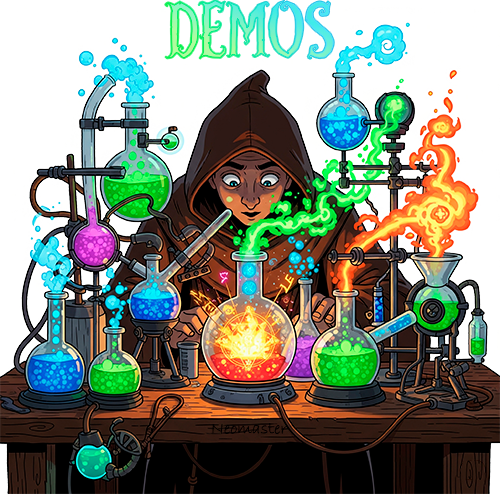

  

# 🧪 DEMOS

## TL;DR
Examples, Experiments, Research 
Look. Try. Add.

## About

👋 Welcome! **This is the personal repository of a Full-Stack developer (.NET + Angular)**, where I collect everything I’ve learned or discovered in real projects.

🔬 I don’t just read theory – I want to see **how it works in practice**! Here you’ll find hands-on examples of basic tools and practical solutions to complex problems you can try yourself.

💡 Even simple concepts are easy to forget, and revisiting them often means writing small console projects. To save time and stay organized, I keep everything in one structured place.

🤝 I’m open to collaboration!

📦 This repository is my personal experience vault, which will continue to grow. New examples, ideas, and practices appear as I learn and work on real projects.

**Small for now 🌱 but growing with each step toward something greater 🌳!**

## .NET

> **Note:** Tests containing `spin` or `yield` may fail depending on the CPU.

Threads

1. [Create, Sleep, Join][threads-1]
2. [Create with arg][threads-2]
3. [Foreground][threads-3]
4. [Background][threads-4]
5. [Info, current thread instance][threads-5]
6. [Is alive][threads-6]
7. [Join with timeout][threads-7]
8. [Abort][threads-8]
9. [Affinity (run parameter)][threads-9]
10. [Affinity (programmatically)][threads-10]
11. [Suspend, Resume][threads-11]
12. [Suspend, Resume: Tick Tock][threads-12]
13. [Abort in Core via `CancellationTokenSource`][threads-13]
14. [Suspend-Resume in Core via `ManualResetEventSlim`][threads-14]
15. [Tick Tock in Core][threads-15]

[threads-1]:Neomaster.Demos.Tests/Threads/ThreadsUnitDemos.cs#L17
[threads-2]:Neomaster.Demos.Tests/Threads/ThreadsUnitDemos.cs#L35
[threads-3]:Neomaster.Demos.Apps/Neomaster.Demos.Apps.Threads.Foreground/Program.cs
[threads-4]:Neomaster.Demos.Apps/Neomaster.Demos.Apps.Threads.Background/Program.cs
[threads-5]:Neomaster.Demos.Tests/Threads/ThreadsUnitDemos.cs#L54
[threads-6]:Neomaster.Demos.Tests/Threads/ThreadsUnitDemos.cs#L80
[threads-7]:Neomaster.Demos.Tests/Threads/ThreadsUnitDemos.cs#L103
[threads-8]:Neomaster.Demos.Apps/Neomaster.Demos.Apps.Threads.AbortThread/Program.cs
[threads-9]:Neomaster.Demos.Apps/Neomaster.Demos.Apps.Threads.AffinityParameterized/Program.cs
[threads-10]:Neomaster.Demos.Apps/Neomaster.Demos.Apps.Threads.AffinityProgrammed/Program.cs
[threads-11]:Neomaster.Demos.Apps/Neomaster.Demos.Apps.Threads.SuspendResume/Program.cs
[threads-12]:Neomaster.Demos.Apps/Neomaster.Demos.Apps.Threads.SuspendResumeTickTock/Program.cs
[threads-13]:Neomaster.Demos.Tests/Threads/ThreadsUnitDemos.cs#L120
[threads-14]:Neomaster.Demos.Tests/Threads/ThreadsUnitDemos.cs#L147
[threads-15]:Neomaster.Demos.Tests/Threads/ThreadsUnitDemos.cs#L168

Threads: Synchronization

1. [`lock()`][threads-sync-1]
2. [Monitor.Enter - Monitor.Exit][threads-sync-2]
3. [Wait Queue][threads-sync-3]
4. [Monitor.PulseAll][threads-sync-4]
5. [Monitor.Pulse][threads-sync-5]
6. [Tick Tock via Monitor.Pulse - Monitor.Wait][threads-sync-6]
7. [Monitor.Wait with timeout as Sleep][threads-sync-7]
8. [`SpinLock` vs `lock()`][threads-sync-8]
9. [Spin lock as Sleep][threads-sync-9]
10. [Spin lock for fast logging][threads-sync-10]
11. [Spin lock throwing `SynchronizationLockException`][threads-sync-11]
12. [Thread.Yield: fast cycle][threads-sync-12]
13. [Thread.SpinWait: fast cycle][threads-sync-13]
14. [SpinWait.SpinOnce][threads-sync-14]
15. [SpinWait.SpinUntil][threads-sync-15]
16. [Semaphore.WaitOne - Release][threads-sync-16]
17. [Semaphore.Release max slots][threads-sync-17]
18. [Semaphore: named for processes][threads-sync-18]
19. [Semaphore: named created new][threads-sync-19]
20. [Mutex as Monitor][threads-sync-20]
21. [Mutex for singleton thread][threads-sync-21]
22. [Mutex for singleton app][threads-sync-22]
23. [Interrupt][threads-sync-23]
24. [Deadlock: recursive locking][threads-sync-24]
25. [Deadlock: mutual waiting, break by Interrupt][threads-sync-25]
26. [Deadlock: mutual waiting, break by Join with timeout][threads-sync-26]

[threads-sync-1]:Neomaster.Demos.Tests/Threads/ThreadsSyncUnitDemos.cs#L12
[threads-sync-2]:Neomaster.Demos.Tests/Threads/ThreadsSyncUnitDemos.cs#L46
[threads-sync-3]:Neomaster.Demos.Tests/Threads/ThreadsSyncUnitDemos.cs#L86
[threads-sync-4]:Neomaster.Demos.Tests/Threads/ThreadsSyncUnitDemos.cs#L115
[threads-sync-5]:Neomaster.Demos.Tests/Threads/ThreadsSyncUnitDemos.cs#L162
[threads-sync-6]:Neomaster.Demos.Tests/Threads/ThreadsSyncUnitDemos.cs#L211
[threads-sync-7]:Neomaster.Demos.Tests/Threads/ThreadsSyncUnitDemos.cs#L271
[threads-sync-8]:Neomaster.Demos.Tests/Threads/ThreadsSyncUnitDemos.cs#L317
[threads-sync-9]:Neomaster.Demos.Tests/Threads/ThreadsSyncUnitDemos.cs#L365
[threads-sync-10]:Neomaster.Demos.Tests/Threads/ThreadsSyncUnitDemos.cs#L427
[threads-sync-11]:Neomaster.Demos.Tests/Threads/ThreadsSyncUnitDemos.cs#L459
[threads-sync-12]:Neomaster.Demos.Tests/Threads/ThreadsSyncUnitDemos.cs#L491
[threads-sync-13]:Neomaster.Demos.Tests/Threads/ThreadsSyncUnitDemos.cs#L577
[threads-sync-14]:Neomaster.Demos.Tests/Threads/ThreadsSyncUnitDemos.cs#L665
[threads-sync-15]:Neomaster.Demos.Tests/Threads/ThreadsSyncUnitDemos.cs#L681
[threads-sync-16]:Neomaster.Demos.Tests/Threads/ThreadsSyncUnitDemos.cs#L700
[threads-sync-17]:Neomaster.Demos.Tests/Threads/ThreadsSyncUnitDemos.cs#L733
[threads-sync-18]:Neomaster.Demos.Tests/Threads/ThreadsSyncUnitDemos.cs#L768
[threads-sync-19]:Neomaster.Demos.Tests/Threads/ThreadsSyncUnitDemos.cs#L820
[threads-sync-20]:Neomaster.Demos.Tests/Threads/ThreadsSyncUnitDemos.cs#L845
[threads-sync-21]:Neomaster.Demos.Tests/Threads/ThreadsSyncUnitDemos.cs#L875
[threads-sync-22]:Neomaster.Demos.Tests/Threads/ThreadsSyncUnitDemos.cs#L917
[threads-sync-23]:Neomaster.Demos.Tests/Threads/ThreadsSyncUnitDemos.cs#L963
[threads-sync-24]:Neomaster.Demos.Tests/Threads/ThreadsSyncUnitDemos.cs#L1007
[threads-sync-25]:Neomaster.Demos.Tests/Threads/ThreadsSyncUnitDemos.cs#L1039
[threads-sync-26]:Neomaster.Demos.Tests/Threads/ThreadsSyncUnitDemos.cs#L1096

Threads: Event Synchronization

1. [EventWaitHandle.Set][threads-event-sync-1]
2. [EventWaitHandle.Reset][threads-event-sync-2]
3. [EventWaitHandle.Set with auto-reset][threads-event-sync-3]
4. [AutoResetEvent.Set][threads-event-sync-4]
5. [ManualResetEvent.Set][threads-event-sync-5]
6. [ManualResetEventSlim.Set][threads-event-sync-6]
7. [ManualResetEventSlim.Wait with timeout][threads-event-sync-7]
8. [CountdownEvent.Wait as Join][threads-event-sync-8]
9. [CountdownEvent.AddCount][threads-event-sync-9]
10. [CountdownEvent.TryAddCount][threads-event-sync-10]
11. [CountdownEvent.IsSet][threads-event-sync-11]
12. [CountdownEvent.Reset][threads-event-sync-12]
13. [CountdownEvent.Reset with arg][threads-event-sync-13]
14. [Barrier: Phases][threads-event-sync-14]
15. [CancellationToken: create token][threads-event-sync-15]
16. [CancellationToken: cancellation request][threads-event-sync-16]
17. [CancellationToken: cancellation callback sequence][threads-event-sync-17]
18. [CancellationToken: cancellation callback sequence: before first exception][threads-event-sync-18]
19. [CancellationToken: cancellation callback sequence: all, ignoring exceptions][threads-event-sync-19]
20. [CancellationToken.ThrowIfCancellationRequested][threads-event-sync-20]
21. [CancellationToken.None usage][threads-event-sync-21]
22. [CancellationToken.None variants][threads-event-sync-22]
23. [CancellationTokenSource.CreateLinkedTokenSource][threads-event-sync-23]

[threads-event-sync-1]:Neomaster.Demos.Tests/Threads/ThreadsEventSyncUnitDemos.cs#L9
[threads-event-sync-2]:Neomaster.Demos.Tests/Threads/ThreadsEventSyncUnitDemos.cs#L74
[threads-event-sync-3]:Neomaster.Demos.Tests/Threads/ThreadsEventSyncUnitDemos.cs#L140
[threads-event-sync-4]:Neomaster.Demos.Tests/Threads/ThreadsEventSyncUnitDemos.cs#L196
[threads-event-sync-5]:Neomaster.Demos.Tests/Threads/ThreadsEventSyncUnitDemos.cs#L252
[threads-event-sync-6]:Neomaster.Demos.Tests/Threads/ThreadsEventSyncUnitDemos.cs#L301
[threads-event-sync-7]:Neomaster.Demos.Tests/Threads/ThreadsEventSyncUnitDemos.cs#L350
[threads-event-sync-8]:Neomaster.Demos.Tests/Threads/ThreadsEventSyncUnitDemos.cs#L374
[threads-event-sync-9]:Neomaster.Demos.Tests/Threads/ThreadsEventSyncUnitDemos.cs#L400
[threads-event-sync-10]:Neomaster.Demos.Tests/Threads/ThreadsEventSyncUnitDemos.cs#L434
[threads-event-sync-11]:Neomaster.Demos.Tests/Threads/ThreadsEventSyncUnitDemos.cs#L447
[threads-event-sync-12]:Neomaster.Demos.Tests/Threads/ThreadsEventSyncUnitDemos.cs#L463
[threads-event-sync-13]:Neomaster.Demos.Tests/Threads/ThreadsEventSyncUnitDemos.cs#L478
[threads-event-sync-14]:Neomaster.Demos.Tests/Threads/ThreadsEventSyncUnitDemos.cs#L493
[threads-event-sync-15]:Neomaster.Demos.Tests/Threads/ThreadsEventSyncUnitDemos.cs#L538
[threads-event-sync-16]:Neomaster.Demos.Tests/Threads/ThreadsEventSyncUnitDemos.cs#L549
[threads-event-sync-17]:Neomaster.Demos.Tests/Threads/ThreadsEventSyncUnitDemos.cs#L576
[threads-event-sync-18]:Neomaster.Demos.Tests/Threads/ThreadsEventSyncUnitDemos.cs#L607
[threads-event-sync-19]:Neomaster.Demos.Tests/Threads/ThreadsEventSyncUnitDemos.cs#L654
[threads-event-sync-20]:Neomaster.Demos.Tests/Threads/ThreadsEventSyncUnitDemos.cs#L701
[threads-event-sync-21]:Neomaster.Demos.Tests/Threads/ThreadsEventSyncUnitDemos.cs#L736
[threads-event-sync-22]:Neomaster.Demos.Tests/Threads/ThreadsEventSyncUnitDemos.cs#L758
[threads-event-sync-23]:Neomaster.Demos.Tests/Threads/ThreadsEventSyncUnitDemos.cs#L775

Threads: Atomic Operations

1. [Volatile class][threads-atomic-operations-1]
2. [Volatile keyword][threads-atomic-operations-2]
3. [Interlocked Increment][threads-atomic-operations-3]

[threads-atomic-operations-1]:Neomaster.Demos.Tests/Threads/ThreadsAtomicOperationsUnitDemos.cs#L10
[threads-atomic-operations-2]:Neomaster.Demos.Tests/Threads/ThreadsAtomicOperationsUnitDemos.cs#L45
[threads-atomic-operations-3]:Neomaster.Demos.Tests/Threads/ThreadsAtomicOperationsUnitDemos.cs#L79

Threads: Thread Pool

1. [Thread Pool: QueueUserWorkItem][threads-thread-pool-1]
2. [Thread Pool: QueueUserWorkItem with state][threads-thread-pool-2]
3. [Thread Pool: QueueUserWorkItem Join][threads-thread-pool-3]
4. [Thread Pool: set pool thread as foreground][threads-thread-pool-4]
5. [Thread Pool: pool restores thread as background][threads-thread-pool-5]

[threads-thread-pool-1]:Neomaster.Demos.Tests/Threads/ThreadsThreadPoolUnitDemos.cs#L8
[threads-thread-pool-2]:Neomaster.Demos.Tests/Threads/ThreadsThreadPoolUnitDemos.cs#L25
[threads-thread-pool-3]:Neomaster.Demos.Tests/Threads/ThreadsThreadPoolUnitDemos.cs#L44
[threads-thread-pool-4]:Neomaster.Demos.Apps/Neomaster.Demos.Apps.Threads.SetPoolThreadAsForeground/Program.cs
[threads-thread-pool-5]:Neomaster.Demos.Tests/Threads/ThreadsThreadPoolUnitDemos.cs#L63

Threads: Features

1. [Synchronized method: instance][threads-features-1]
2. [Synchronized method: static][threads-features-2]
3. [Synchronized method: instance in different threads][threads-features-3]
4. [Synchronized method: static in different threads][threads-features-4]
5. [ThreadLocal&lt;T&gt;: counters][threads-features-5]
6. [Lazy&lt;T&gt;: lazy initialization][threads-features-6]
7. [Lazy&lt;T&gt;: single initialization][threads-features-7]
8. [Lazy&lt;T&gt;: multiple initialization][threads-features-8]
9. [Lazy&lt;T&gt;: unsafe initialization][threads-features-9]

[threads-features-1]:Neomaster.Demos.Tests/Threads/ThreadsFeaturesUnitDemos.cs#L10
[threads-features-2]:Neomaster.Demos.Tests/Threads/ThreadsFeaturesUnitDemos.cs#L26
[threads-features-3]:Neomaster.Demos.Tests/Threads/ThreadsFeaturesUnitDemos.cs#L41
[threads-features-4]:Neomaster.Demos.Tests/Threads/ThreadsFeaturesUnitDemos.cs#L86
[threads-features-5]:Neomaster.Demos.Tests/Threads/ThreadsFeaturesUnitDemos.cs#L129
[threads-features-6]:Neomaster.Demos.Tests/Threads/ThreadsFeaturesUnitDemos.cs#L151
[threads-features-7]:Neomaster.Demos.Tests/Threads/ThreadsFeaturesUnitDemos.cs#L163
[threads-features-8]:Neomaster.Demos.Tests/Threads/ThreadsFeaturesUnitDemos.cs#L197
[threads-features-9]:Neomaster.Demos.Tests/Threads/ThreadsFeaturesUnitDemos.cs#L240

Tasks

1. [Create task][tasks-1]
2. [Task is in pool thread][tasks-2]
3. [Wait task][tasks-3]
4. [Wait task with timeout][tasks-4]
5. [Task is running after wait timeout][tasks-5]
6. [Wait task with cancellation token][tasks-6]
7. [Wait blocks thread][tasks-7]
8. [Wait wraps task exception into `AggregateException`][tasks-8]
9. [Result][tasks-9]
10. [Result blocks thread][tasks-10]
11. [Result wraps task exception into `AggregateException`][tasks-11]
12. [Delay][tasks-12]
13. [Delay with cancellation token][tasks-13]
14. [Delay is working after wait timeout][tasks-14]
15. [`await` releases manual thread][tasks-15]
16. [`await` releases pool thread][tasks-16]
17. [Method with `async`, without `await` is synchronous][tasks-17]
18. [Method with `async`, with `await` is asynchronous][tasks-18]
19. [ConfigureAwait][tasks-19]
20. [ConfigureAwait: effect on default sync context Post and Send][tasks-20]
21. [ConfigureAwait: effect on UI sync context Post and Send][tasks-21]
22. [Throwing task exception][tasks-22]
23. [ContinueWith: created task status][tasks-23]
24. [ContinueWith: task chain][tasks-24]
25. [ContinueWith: variable continuation][tasks-25]
26. [ContinueWith: continuation options][tasks-26]
27. [ContinueWith: SetInterval()][tasks-27]
28. [RunSynchronously][tasks-28]
29. [RunSynchronously and continuation][tasks-29]
30. [RunSynchronously and synchronous continuation][tasks-30]
31. [RunSynchronously continuation][tasks-31]
32. [Set status to `TaskStatus.Canceled` after cancellation by `Token.ThrowIfCancellationRequested()`][tasks-32]
33. [WhenAll][tasks-33]
34. [WhenAll: task exceptions][tasks-34]
35. [WhenAll with canceled task][tasks-35]
36. [WhenAll with incorrect canceled task][tasks-36]
37. [WaitAll][tasks-37]
38. [WaitAll: task exceptions][tasks-38]
39. [WhenAny][tasks-39]
40. [WhenAny: timeout][tasks-40]
41. [WhenAny: task exception][tasks-41]
42. [WaitAny][tasks-42]
43. [WaitAny: task exception][tasks-43]
44. [WhenEach][tasks-44]
45. [Yield][tasks-45]
46. [Awaiter: GetResult][tasks-46]
47. [Awaiter: OnCompleted][tasks-47]
48. [Awaiter: pattern][tasks-48]
49. [Awaiter: timespan awaiter][tasks-49]
50. [TaskCompletionSource: timeout][tasks-50]
51. [TaskCompletionSource: WithTimeout() extension][tasks-51]
52. [TaskCompletionSource: external event source adapter][tasks-52]
53. [FromResult][tasks-53]
54. [FromCanceled][tasks-54]
55. [FromException][tasks-55]
56. [CompletedTask][tasks-56]
57. [ValueTask: cached result][tasks-57]
58. [Factory][tasks-58]
59. [Factory: continuations][tasks-59]
60. [Factory: `TaskCreationOptions.LongRunning`][tasks-60]
61. [Factory: child task attachment, `TaskCreationOptions.DenyChildAttach`][tasks-61]
62. [Factory: set task schedulers][tasks-62]

[tasks-1]:Neomaster.Demos.Tests/Tasks/TasksUnitDemos.cs#L8
[tasks-2]:Neomaster.Demos.Tests/Tasks/TasksUnitDemos.cs#L35
[tasks-3]:Neomaster.Demos.Tests/Tasks/TasksUnitDemos.cs#L50
[tasks-4]:Neomaster.Demos.Tests/Tasks/TasksUnitDemos.cs#L66
[tasks-5]:Neomaster.Demos.Tests/Tasks/TasksUnitDemos.cs#L79
[tasks-6]:Neomaster.Demos.Tests/Tasks/TasksUnitDemos.cs#L101
[tasks-7]:Neomaster.Demos.Tests/Tasks/TasksUnitDemos.cs#L119
[tasks-8]:Neomaster.Demos.Tests/Tasks/TasksUnitDemos.cs#L143
[tasks-9]:Neomaster.Demos.Tests/Tasks/TasksUnitDemos.cs#L160
[tasks-10]:Neomaster.Demos.Tests/Tasks/TasksUnitDemos.cs#L168
[tasks-11]:Neomaster.Demos.Tests/Tasks/TasksUnitDemos.cs#L191
[tasks-12]:Neomaster.Demos.Tests/Tasks/TasksUnitDemos.cs#L209
[tasks-13]:Neomaster.Demos.Tests/Tasks/TasksUnitDemos.cs#L221
[tasks-14]:Neomaster.Demos.Tests/Tasks/TasksUnitDemos.cs#L234
[tasks-15]:Neomaster.Demos.Tests/Tasks/TasksUnitDemos.cs#L244
[tasks-16]:Neomaster.Demos.Tests/Tasks/TasksUnitDemos.cs#L281
[tasks-17]:Neomaster.Demos.Tests/Tasks/TasksUnitDemos.cs#L326
[tasks-18]:Neomaster.Demos.Tests/Tasks/TasksUnitDemos.cs#L353
[tasks-19]:Neomaster.Demos.Apps/Neomaster.Demos.Apps.Tasks.TaskConfigureAwait/Form1.cs
[tasks-20]:Neomaster.Demos.Tests/Tasks/TasksUnitDemos.cs#L382
[tasks-21]:Neomaster.Demos.Tests/Tasks/TasksUnitDemos.cs#L408
[tasks-22]:Neomaster.Demos.Tests/Tasks/TasksUnitDemos.cs#L432
[tasks-23]:Neomaster.Demos.Tests/Tasks/TasksUnitDemos.cs#L503
[tasks-24]:Neomaster.Demos.Tests/Tasks/TasksUnitDemos.cs#L510
[tasks-25]:Neomaster.Demos.Tests/Tasks/TasksUnitDemos.cs#L520
[tasks-26]:Neomaster.Demos.Tests/Tasks/TasksUnitDemos.cs#L553
[tasks-27]:Neomaster.Demos.Tests/Tasks/TasksUnitDemos.cs#L569
[tasks-28]:Neomaster.Demos.Tests/Tasks/TasksUnitDemos.cs#L616
[tasks-29]:Neomaster.Demos.Tests/Tasks/TasksUnitDemos.cs#L638
[tasks-30]:Neomaster.Demos.Tests/Tasks/TasksUnitDemos.cs#L674
[tasks-31]:Neomaster.Demos.Tests/Tasks/TasksUnitDemos.cs#L712
[tasks-32]:Neomaster.Demos.Tests/Tasks/TasksUnitDemos.cs#L731
[tasks-33]:Neomaster.Demos.Tests/Tasks/TasksUnitDemos.cs#L759
[tasks-34]:Neomaster.Demos.Tests/Tasks/TasksUnitDemos.cs#L780
[tasks-35]:Neomaster.Demos.Tests/Tasks/TasksUnitDemos.cs#L840
[tasks-36]:Neomaster.Demos.Tests/Tasks/TasksUnitDemos.cs#L864
[tasks-37]:Neomaster.Demos.Tests/Tasks/TasksUnitDemos.cs#L899
[tasks-38]:Neomaster.Demos.Tests/Tasks/TasksUnitDemos.cs#L921
[tasks-39]:Neomaster.Demos.Tests/Tasks/TasksUnitDemos.cs#L968
[tasks-40]:Neomaster.Demos.Tests/Tasks/TasksUnitDemos.cs#L989
[tasks-41]:Neomaster.Demos.Tests/Tasks/TasksUnitDemos.cs#L1014
[tasks-42]:Neomaster.Demos.Tests/Tasks/TasksUnitDemos.cs#L1033
[tasks-43]:Neomaster.Demos.Tests/Tasks/TasksUnitDemos.cs#L1052
[tasks-44]:Neomaster.Demos.Tests/Tasks/TasksUnitDemos.cs#L1071
[tasks-45]:Neomaster.Demos.Tests/Tasks/TasksUnitDemos.cs#L1110
[tasks-46]:Neomaster.Demos.Tests/Tasks/TasksUnitDemos.cs#L1168
[tasks-47]:Neomaster.Demos.Tests/Tasks/TasksUnitDemos.cs#L1180
[tasks-48]:Neomaster.Demos.Tests/Tasks/TasksUnitDemos.cs#L1207
[tasks-49]:Neomaster.Demos.Tests/Tasks/TasksUnitDemos.cs#L1259
[tasks-50]:Neomaster.Demos.Tests/Tasks/TasksUnitDemos.cs#L1270
[tasks-51]:Neomaster.Demos.Tests/Tasks/TasksUnitDemos.cs#L1295
[tasks-52]:Neomaster.Demos.Tests/Tasks/TasksUnitDemos.cs#L1304
[tasks-53]:Neomaster.Demos.Tests/Tasks/TasksUnitDemos.cs#L1320
[tasks-54]:Neomaster.Demos.Tests/Tasks/TasksUnitDemos.cs#L1329
[tasks-55]:Neomaster.Demos.Tests/Tasks/TasksUnitDemos.cs#L1351
[tasks-56]:Neomaster.Demos.Tests/Tasks/TasksUnitDemos.cs#L1373
[tasks-57]:Neomaster.Demos.Tests/Tasks/TasksUnitDemos.cs#L1380
[tasks-58]:Neomaster.Demos.Tests/Tasks/TasksUnitDemos.cs#L1416
[tasks-59]:Neomaster.Demos.Tests/Tasks/TasksUnitDemos.cs#L1432
[tasks-60]:Neomaster.Demos.Tests/Tasks/TasksUnitDemos.cs#L1460
[tasks-61]:Neomaster.Demos.Tests/Tasks/TasksUnitDemos.cs#L1473
[tasks-62]:Neomaster.Demos.Tests/Tasks/TasksUnitDemos.cs#L1492

Tasks: Synchronization

1. [`lock` within task][tasks-synchronization-1]
2. [task within `lock`][tasks-synchronization-2]
3. [Lock via semaphore][tasks-synchronization-3]

[tasks-synchronization-1]:Neomaster.Demos.Tests/Tasks/TasksSyncUnitDemos.cs#L8
[tasks-synchronization-2]:Neomaster.Demos.Tests/Tasks/TasksSyncUnitDemos.cs#L53
[tasks-synchronization-3]:Neomaster.Demos.Tests/Tasks/TasksSyncUnitDemos.cs#L63

Tasks: Features

1. [Timer: Callback][tasks-features-1]
2. [Timer: AutoReset: false][tasks-features-2]
3. [Timer: Alarms][tasks-features-3]
4. [Parallel: `For()`][tasks-features-4]
5. [Parallel: `Stop()`][tasks-features-5]
6. [Parallel: `Break()`][tasks-features-6]
7. [Parallel: Local Var][tasks-features-7]
8. [Parallel: Exception][tasks-features-8]
9. [Parallel: `ParallelOptions`][tasks-features-9]
10. [Parallel: State Checks][tasks-features-10]
11. [Parallel: `Foreach()`][tasks-features-11]
12. [Parallel: `Invoke()`][tasks-features-12]

[tasks-features-1]:Neomaster.Demos.Tests/Tasks/TasksFeaturesUnitDemos.cs#L10
[tasks-features-2]:Neomaster.Demos.Tests/Tasks/TasksFeaturesUnitDemos.cs#L37
[tasks-features-3]:Neomaster.Demos.Tests/Tasks/TasksFeaturesUnitDemos.cs#L61
[tasks-features-4]:Neomaster.Demos.Tests/Tasks/TasksFeaturesUnitDemos.cs#L110
[tasks-features-5]:Neomaster.Demos.Tests/Tasks/TasksFeaturesUnitDemos.cs#L134
[tasks-features-6]:Neomaster.Demos.Tests/Tasks/TasksFeaturesUnitDemos.cs#L170
[tasks-features-7]:Neomaster.Demos.Tests/Tasks/TasksFeaturesUnitDemos.cs#L207
[tasks-features-8]:Neomaster.Demos.Tests/Tasks/TasksFeaturesUnitDemos.cs#L236
[tasks-features-9]:Neomaster.Demos.Tests/Tasks/TasksFeaturesUnitDemos.cs#L280
[tasks-features-10]:Neomaster.Demos.Tests/Tasks/TasksFeaturesUnitDemos.cs#L298
[tasks-features-11]:Neomaster.Demos.Tests/Tasks/TasksFeaturesUnitDemos.cs#L325
[tasks-features-12]:Neomaster.Demos.Tests/Tasks/TasksFeaturesUnitDemos.cs#L360

Tasks: Activity Types

1. [`AlarmInfo`][tasks-activity-types-1]
2. [`CustomTaskScheduler`][tasks-activity-types-2]
3. [`DefaultSyncCtx`][tasks-activity-types-3]
4. [`ExternalEventSource`][tasks-activity-types-4]
5. [`ExternalEventSourceAdapter`][tasks-activity-types-5]
6. [`TaskExtensions`][tasks-activity-types-6]
7. [`TimeSpanAwaiter`][tasks-activity-types-7]
8. [`UISyncCtx`][tasks-activity-types-8]

[tasks-activity-types-1]:Neomaster.Demos.Tests/Tasks/ActivityTypes/AlarmInfo.cs
[tasks-activity-types-2]:Neomaster.Demos.Tests/Tasks/ActivityTypes/CustomTaskScheduler.cs
[tasks-activity-types-3]:Neomaster.Demos.Tests/Tasks/ActivityTypes/DefaultSyncCtx.cs
[tasks-activity-types-4]:Neomaster.Demos.Tests/Tasks/ActivityTypes/ExternalEventSource.cs
[tasks-activity-types-5]:Neomaster.Demos.Tests/Tasks/ActivityTypes/ExternalEventSourceAdapter.cs
[tasks-activity-types-6]:Neomaster.Demos.Tests/Tasks/ActivityTypes/TaskExtensions.cs
[tasks-activity-types-7]:Neomaster.Demos.Tests/Tasks/ActivityTypes/TimeSpanAwaiter.cs
[tasks-activity-types-8]:Neomaster.Demos.Tests/Tasks/ActivityTypes/UISyncCtx.cs

LINQ: Expression Trees

1. [Tree structure: view][linq-expression-trees-1]
2. [Tree structure: create: left operand via `Expression.MakeMemberAccess`][linq-expression-trees-2]
3. [Tree structure: create: left operand via `Expression.Property`][linq-expression-trees-3]
4. [Tree structure: create: 3 levels][linq-expression-trees-4]
5. [Lambda: create `Func1`][linq-expression-trees-5]
6. [Lambda: create `Func2`][linq-expression-trees-6]
7. [Lambda: parameter order][linq-expression-trees-7]
8. [Lambda: info][linq-expression-trees-8]
9. [Lambda: view with named parameters][linq-expression-trees-9]
10. [Lambda: typed vs untyped][linq-expression-trees-10]
11. [Lambda: `DynamicInvoke()`: dynamic `Func`][linq-expression-trees-11]
12. [Lambda: `DynamicInvoke()`: dynamic Add][linq-expression-trees-12]
13. [`ExpressionType`: list of all][linq-expression-trees-13]
14. [Debug view][linq-expression-trees-14]
15. [Debug view: lambda][linq-expression-trees-15]
16. [`Reduce()`][linq-expression-trees-16]
17. [`ReduceAndCheck()`: reducible][linq-expression-trees-17]
18. [`ReduceAndCheck()`: not reducible][linq-expression-trees-18]
19. [`ReduceAndCheck()`: prevent return `null` and `this`][linq-expression-trees-19]
20. [`ReduceExtensions()`: builtin root][linq-expression-trees-20]
21. [`ReduceExtensions()`: custom root: reducible][linq-expression-trees-21]
22. [`ReduceExtensions()`: custom root: not reducible][linq-expression-trees-22]
23. [`IsByRef`: struct parameter: with `ref` modifier][linq-expression-trees-23]
24. [`IsByRef`: reference parameter: without `ref` modifier][linq-expression-trees-24]
25. [`IsByRef`: reference parameter: with `ref` modifier][linq-expression-trees-25]
26. [Visitor: root][linq-expression-trees-26]
27. [Visitor: tree: immutable][linq-expression-trees-27]
28. [Visitor: tree: with mutable child node][linq-expression-trees-28]
29. [`Expression.Invoke`][linq-expression-trees-29]
30. [`Expression.Call`: instance method][linq-expression-trees-30]
31. [`Expression.Call`: static method][linq-expression-trees-31]
32. [`Expression.New`][linq-expression-trees-32]
33. [`Expression.MemberInit`, `Expression.Bind`][linq-expression-trees-33]
34. [`Expression.MemberBind`][linq-expression-trees-34]
35. [`Expression.Quote`: lambda returns lambda][linq-expression-trees-35]
36. [`Expression.Quote`: lambda returns lambda: in DB provider][linq-expression-trees-36]
37. [`Expression.Assign`][linq-expression-trees-37]
38. [`Expression.Block`, `Expression.Variable`: `Swap(x, y)`][linq-expression-trees-38]
39. [`Expression.Block` returns last expression result][linq-expression-trees-39]
40. [Conditional operators][linq-expression-trees-40]
41. [`Expression.Throw`][linq-expression-trees-41]
42. [`Expression.Goto`, `Expression.Label`: empty][linq-expression-trees-42]
43. [`Expression.Goto`, `Expression.Label`: instruction][linq-expression-trees-43]
44. [`Expression.Goto`, `Expression.Label`: return value][linq-expression-trees-44]
45. [`Expression.Return` like `Expression.Goto`][linq-expression-trees-45]
46. [`Expression.Return` vs `Expression.Goto`: semantic difference][linq-expression-trees-46]
47. [`Expression.Return` vs `Expression.Goto`: call via kind][linq-expression-trees-47]
48. [`Expression.Loop`, `Expression.Break`: power to 10][linq-expression-trees-48]
49. [`Expression.Loop`, `Expression.Break`: select even][linq-expression-trees-49]
50. [`GotoExpressionKind`: list of all][linq-expression-trees-50]
51. [`Expression.TryCatchFinally`][linq-expression-trees-51]
52. [Reverse Polish Notation][linq-expression-trees-52]
53. [Auto-mapper][linq-expression-trees-53]
54. [SQL generation][linq-expression-trees-54]

[linq-expression-trees-1]: Neomaster.Demos.Tests/LinqExpr/LinqExprUnitDemos.cs#L16
[linq-expression-trees-2]: Neomaster.Demos.Tests/LinqExpr/LinqExprUnitDemos.cs#L45
[linq-expression-trees-3]: Neomaster.Demos.Tests/LinqExpr/LinqExprUnitDemos.cs#L82
[linq-expression-trees-4]: Neomaster.Demos.Tests/LinqExpr/LinqExprUnitDemos.cs#L118
[linq-expression-trees-5]: Neomaster.Demos.Tests/LinqExpr/LinqExprUnitDemos.cs#L155
[linq-expression-trees-6]: Neomaster.Demos.Tests/LinqExpr/LinqExprUnitDemos.cs#L170
[linq-expression-trees-7]: Neomaster.Demos.Tests/LinqExpr/LinqExprUnitDemos.cs#L195
[linq-expression-trees-8]: Neomaster.Demos.Tests/LinqExpr/LinqExprUnitDemos.cs#L210
[linq-expression-trees-9]: Neomaster.Demos.Tests/LinqExpr/LinqExprUnitDemos.cs#L247
[linq-expression-trees-10]: Neomaster.Demos.Tests/LinqExpr/LinqExprUnitDemos.cs#L277
[linq-expression-trees-11]: Neomaster.Demos.Tests/LinqExpr/LinqExprUnitDemos.cs#L293
[linq-expression-trees-12]: Neomaster.Demos.Tests/LinqExpr/LinqExprUnitDemos.cs#L312
[linq-expression-trees-13]: Neomaster.Demos.Tests/LinqExpr/LinqExprUnitDemos.cs#L331
[linq-expression-trees-14]: Neomaster.Demos.Tests/LinqExpr/LinqExprUnitDemos.cs#L341
[linq-expression-trees-15]: Neomaster.Demos.Tests/LinqExpr/LinqExprUnitDemos.cs#L380
[linq-expression-trees-16]: Neomaster.Demos.Tests/LinqExpr/LinqExprUnitDemos.cs#L409
[linq-expression-trees-17]: Neomaster.Demos.Tests/LinqExpr/LinqExprUnitDemos.cs#L447
[linq-expression-trees-18]: Neomaster.Demos.Tests/LinqExpr/LinqExprUnitDemos.cs#L475
[linq-expression-trees-19]: Neomaster.Demos.Tests/LinqExpr/LinqExprUnitDemos.cs#L497
[linq-expression-trees-20]: Neomaster.Demos.Tests/LinqExpr/LinqExprUnitDemos.cs#L504
[linq-expression-trees-21]: Neomaster.Demos.Tests/LinqExpr/LinqExprUnitDemos.cs#L518
[linq-expression-trees-22]: Neomaster.Demos.Tests/LinqExpr/LinqExprUnitDemos.cs#L532
[linq-expression-trees-23]: Neomaster.Demos.Tests/LinqExpr/LinqExprUnitDemos.cs#L545
[linq-expression-trees-24]: Neomaster.Demos.Tests/LinqExpr/LinqExprUnitDemos.cs#L560
[linq-expression-trees-25]: Neomaster.Demos.Tests/LinqExpr/LinqExprUnitDemos.cs#L575
[linq-expression-trees-26]: Neomaster.Demos.Tests/LinqExpr/LinqExprUnitDemos.cs#L590
[linq-expression-trees-27]: Neomaster.Demos.Tests/LinqExpr/LinqExprUnitDemos.cs#L630
[linq-expression-trees-28]: Neomaster.Demos.Tests/LinqExpr/LinqExprUnitDemos.cs#L650
[linq-expression-trees-29]: Neomaster.Demos.Tests/LinqExpr/LinqExprUnitDemos.cs#L671
[linq-expression-trees-30]: Neomaster.Demos.Tests/LinqExpr/LinqExprUnitDemos.cs#L696
[linq-expression-trees-31]: Neomaster.Demos.Tests/LinqExpr/LinqExprUnitDemos.cs#L708
[linq-expression-trees-32]: Neomaster.Demos.Tests/LinqExpr/LinqExprUnitDemos.cs#L724
[linq-expression-trees-33]: Neomaster.Demos.Tests/LinqExpr/LinqExprUnitDemos.cs#L753
[linq-expression-trees-34]: Neomaster.Demos.Tests/LinqExpr/LinqExprUnitDemos.cs#L774
[linq-expression-trees-35]: Neomaster.Demos.Tests/LinqExpr/LinqExprUnitDemos.cs#L805
[linq-expression-trees-36]: Neomaster.Demos.Tests/LinqExpr/LinqExprUnitDemos.cs#L840
[linq-expression-trees-37]: Neomaster.Demos.Tests/LinqExpr/LinqExprUnitDemos.cs#L878
[linq-expression-trees-38]: Neomaster.Demos.Tests/LinqExpr/LinqExprUnitDemos.cs#L898
[linq-expression-trees-39]: Neomaster.Demos.Tests/LinqExpr/LinqExprUnitDemos.cs#L921
[linq-expression-trees-40]: Neomaster.Demos.Tests/LinqExpr/LinqExprUnitDemos.cs#L935
[linq-expression-trees-41]: Neomaster.Demos.Tests/LinqExpr/LinqExprUnitDemos.cs#L989
[linq-expression-trees-42]: Neomaster.Demos.Tests/LinqExpr/LinqExprUnitDemos.cs#L1023
[linq-expression-trees-43]: Neomaster.Demos.Tests/LinqExpr/LinqExprUnitDemos.cs#L1046
[linq-expression-trees-44]: Neomaster.Demos.Tests/LinqExpr/LinqExprUnitDemos.cs#L1068
[linq-expression-trees-45]: Neomaster.Demos.Tests/LinqExpr/LinqExprUnitDemos.cs#L1085
[linq-expression-trees-46]: Neomaster.Demos.Tests/LinqExpr/LinqExprUnitDemos.cs#L1101
[linq-expression-trees-47]: Neomaster.Demos.Tests/LinqExpr/LinqExprUnitDemos.cs#L1116
[linq-expression-trees-48]: Neomaster.Demos.Tests/LinqExpr/LinqExprUnitDemos.cs#L1143
[linq-expression-trees-49]: Neomaster.Demos.Tests/LinqExpr/LinqExprUnitDemos.cs#L1172
[linq-expression-trees-50]: Neomaster.Demos.Tests/LinqExpr/LinqExprUnitDemos.cs#L1211
[linq-expression-trees-51]: Neomaster.Demos.Tests/LinqExpr/LinqExprUnitDemos.cs#L1232
[linq-expression-trees-52]: Neomaster.Demos.Tests/LinqExpr/LinqExprUnitDemos.cs#L1256
[linq-expression-trees-53]: Neomaster.Demos.Tests/LinqExpr/LinqExprUnitDemos.cs#L1286
[linq-expression-trees-54]: Neomaster.Demos.Tests/LinqExpr/LinqExprUnitDemos.cs#L1327

LINQ: Activity Types

1. [`BrokenReducible`][linq-activity-types-1]
2. [`Department`][linq-activity-types-2]
3. [`ExpressionExtensions`][linq-activity-types-3]
4. [`IntAddVisitor`][linq-activity-types-4]
5. [`LinqExprDemoDbContext`][linq-activity-types-5]
6. [`LinqExprDemoDbContextFixture`][linq-activity-types-6]
7. [`ReducibleIntAdd`][linq-activity-types-7]
8. [`User`][linq-activity-types-8]
9. [`UserDto`][linq-activity-types-9]

[linq-activity-types-1]:Neomaster.Demos.Tests/LinqExpr/ActivityTypes/BrokenReducible.cs
[linq-activity-types-2]:Neomaster.Demos.Tests/LinqExpr/ActivityTypes/Department.cs
[linq-activity-types-3]:Neomaster.Demos.Tests/LinqExpr/ActivityTypes/ExpressionExtensions.cs
[linq-activity-types-4]:Neomaster.Demos.Tests/LinqExpr/ActivityTypes/IntAddVisitor.cs
[linq-activity-types-5]:Neomaster.Demos.Tests/LinqExpr/ActivityTypes/LinqExprDemoDbContext.cs
[linq-activity-types-6]:Neomaster.Demos.Tests/LinqExpr/ActivityTypes/LinqExprDemoDbContextFixture.cs
[linq-activity-types-7]:Neomaster.Demos.Tests/LinqExpr/ActivityTypes/ReducibleIntAdd.cs
[linq-activity-types-8]:Neomaster.Demos.Tests/LinqExpr/ActivityTypes/User.cs
[linq-activity-types-9]:Neomaster.Demos.Tests/LinqExpr/ActivityTypes/UserDto.cs

Archives: ZIP

1. [Create 1 root file][archives-zip-1]
2. [Create N root files][archives-zip-2]
3. [Create N folder files][archives-zip-3]
4. [Create Word doc][archives-zip-4]

[archives-zip-1]:Neomaster.Demos.Tests/Archives/ArchivesZipUnitDemos.cs#L15
[archives-zip-2]:Neomaster.Demos.Tests/Archives/ArchivesZipUnitDemos.cs#L27
[archives-zip-3]:Neomaster.Demos.Tests/Archives/ArchivesZipUnitDemos.cs#L43
[archives-zip-4]:Neomaster.Demos.Tests/Archives/ArchivesZipUnitDemos.cs#L59

